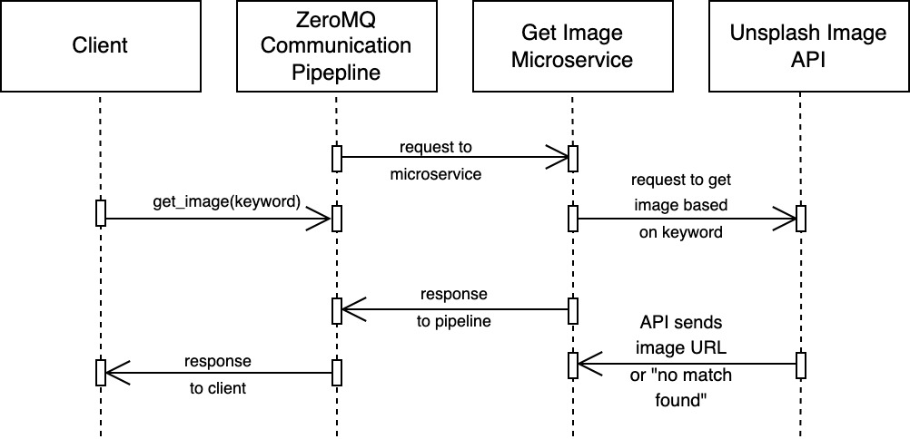

## Image Generator Microservice

**Communication Contract**

### How to Request Data (Write your own client):
1. Make sure pyzmq and request libraries are installed. You can use the following command: `pip3 install pyzmq requests`

Make sure to import these into your code. 

2. Set up a ZeroMQ REQ socket. Connect this socket to the server's address. 
3. Use this socket to send a keyword (string) to the server. 
4. Wait for and receive the response.

**Example Call** \
`get_image("spa")` 

### How to Receive Data (Using server.py):

1. Make sure pyzmq and request libraries are installed. You can use the following command: `pip3 install pyzmq requests`

Make sure to import these into your code. 

2. Set up a ZeroMQ REP socket. Connect this socket to the server's address. 
3. Use this socket to listen for keywords being sent.
4. Send the keyword to the Unsplash API and send back the response. 

### Other Notes

* You must have ZeroMQ installed using command `pip3 install pyzmq`

* You must create your own Unsplash API Key using [the Unsplash API developers site](https://unsplash.com/developers). Replace `your_api_key` in the server.py file with your key. 

### Diagram

